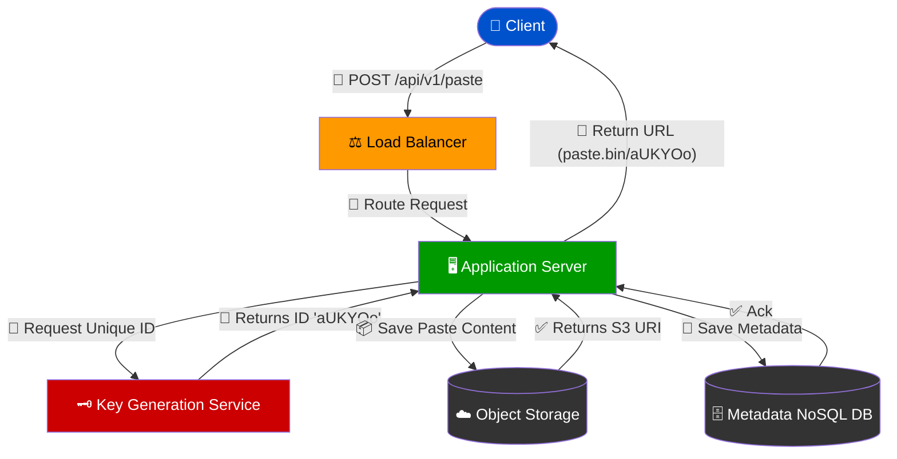
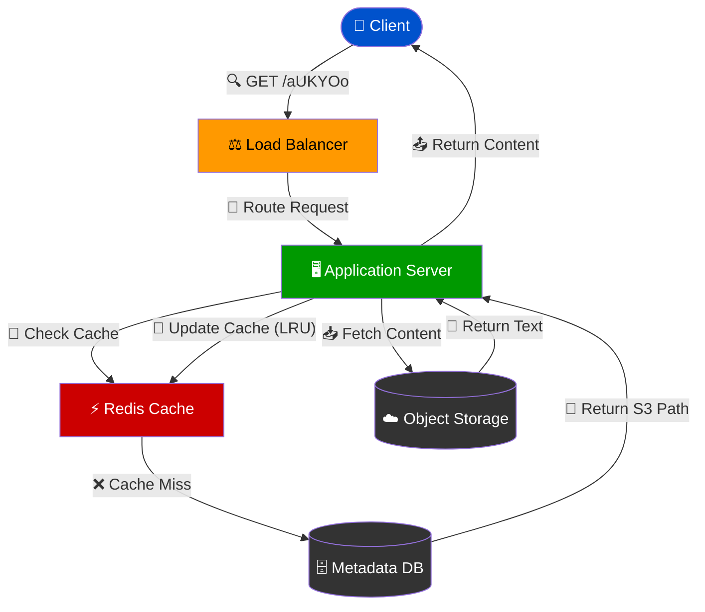

# System Design: Architecting a Pastebin Service

## Glossary

- **Pastebin**: A web application that allows users to store plain text or code snippets and share them via a unique, shortened URL.
- **Base62 Encoding**: A method of encoding numerical identifiers into a string using 62 characters (A-Z, a-z, 0-9) to create short, URL-safe aliases.
- **Key Generation Service (KGS)**: A standalone backend service responsible for pre-generating and dispensing unique identifiers to prevent collisions and reduce latency during write operations.
- **Hash Collision**: A scenario where a hashing algorithm generates the same output for two different inputs. In a Pastebin system, this occurs if two concurrent pastes generate the same unique URL.
- **Object Storage**: A storage architecture that manages data as objects, highly suitable for storing unstructured data like large text files or code snippets (e.g., Amazon S3).
- **Content Delivery Network (CDN)**: A geographically distributed network of proxy servers designed to cache static content closer to end-users, reducing latency for read requests.
- **Sharding**: A database architecture pattern related to horizontal partitioning, where rows of a database table are held separately to distribute the load.
- **Least Recently Used (LRU)**: A cache eviction algorithm that discards the least recently accessed items first when the cache reaches its capacity limit.

## Core Concepts

Designing a scalable Pastebin service requires a deep understanding of distributed systems, efficient data storage, and high-concurrency request handling. The system must accommodate a read-heavy workload while ensuring that write operations are highly available and durable. 

### Requirements Analysis

Before architecting the system, the functional and non-functional requirements must be clearly defined. 

**Functional Requirements:**
1. Users must be able to upload or paste text and receive a unique, shortened URL.
2. Users must be able to retrieve the pasted text by visiting the generated URL.
3. Users should optionally be able to set an expiration time for the paste.
4. The system should optionally support custom aliases for URLs.

**Non-Functional Requirements:**
1. **High Availability:** The system must be highly available. If the service goes down, users cannot access their shared code snippets, which breaks dependent workflows.
2. **Low Latency:** Read requests must be served with minimal latency.
3. **Immutability:** Once a paste is created, it cannot be modified (append-only/immutable data model).
4. **Non-Guessable URLs:** Generated URLs should not be easily predictable to prevent malicious scraping of unlisted pastes.

### Capacity Estimation

A critical step in system design is estimating the scale of the system to make informed architectural decisions. Pastebin is a read-heavy system, typically exhibiting a 10:1 read-to-write ratio.

Assuming the system handles 1 million new pastes per day:
- **Write Requests:** 1 million / 24 hours / 3600 seconds ≈ 12 writes per second.
- **Read Requests:** 10 million / 24 hours / 3600 seconds ≈ 115 reads per second.

**Storage Requirements:**
If the maximum size of a paste is 10 MB, but the average size is 10 KB, we can calculate the daily storage requirement:
- 1 million pastes * 10 KB = 10 GB per day.
- Over 10 years: 10 GB/day * 365 days/year * 10 years ≈ 36.5 TB of storage.

Because the total storage requirement for text data is relatively large, storing the raw text directly in a relational database is inefficient. This necessitates a hybrid storage approach.

### High-Level Architecture

The architecture consists of several decoupled layers to ensure scalability and fault tolerance:

1. **Client Layer:** Web browsers or CLI tools interacting with the service.
2. **Load Balancer Layer:** Distributes incoming traffic across multiple application servers to prevent any single server from becoming a bottleneck.
3. **Application Servers:** Stateless web servers that handle API requests, validate inputs, and coordinate with backend services.
4. **Key Generation Service (KGS):** To guarantee uniqueness and fast write speeds, the KGS pre-generates random Base62 strings and stores them in a database. When an application server needs a new URL, it simply requests one from the KGS cache.
5. **Data Storage Layer:** Divided into Metadata Storage and Content Storage.

### Data Storage Strategy

To optimize cost and performance, the storage is split into two distinct systems:

1. **Metadata Database:** Stores information about the paste (e.g., `paste_id`, `user_id`, `creation_date`, `expiration_date`, `s3_link`). A NoSQL database like Amazon DynamoDB or Apache Cassandra is ideal here due to its high availability and easy horizontal scaling.
2. **Object Storage:** The actual text content is stored in an Object Storage service like Amazon S3. Object storage is highly durable, cost-effective for large blobs of text, and scales infinitely.

| Feature | Relational Database (SQL) | NoSQL (e.g., DynamoDB / Cassandra) | Object Storage (e.g., Amazon S3) |
| :--- | :--- | :--- | :--- |
| **Primary Use Case** | Complex queries, ACID transactions | High-speed metadata retrieval, horizontal scaling | Storing raw text/code snippets |
| **Scalability** | Vertical (expensive at scale) | Horizontal (highly scalable) | Infinite (managed by cloud provider) |
| **Schema** | Rigid | Flexible | Unstructured |
| **Role in Pastebin** | User management (optional) | Paste metadata (ID, expiration, S3 path) | Raw paste content storage |

## Examples

To fully understand the mechanics of the Pastebin system, we must examine the specific algorithms, data flows, and API contracts that drive the application.

### Example 1: Key Generation Service (KGS) Flow

Generating a unique hash on the fly during a write request can lead to hash collisions. If two users submit a paste at the exact same millisecond, an MD5 hash of their timestamp and IP might collide. 

To solve this, we use a Key Generation Service (KGS) that pre-computes unique Base62 strings. Base62 utilizes 62 characters (`A-Z`, `a-z`, `0-9`). A 7-character Base62 string provides $62^7$ (approx. 3.5 trillion) unique combinations, which is more than enough for our 10-year capacity estimation.

```mermaid
flowchart LR
    Start([🏁 KGS Initialization]) --> Gen[⚙️ Generate Base62 Strings]
    Gen -- 📥 Bulk Insert --> Unused[(🟢 Unused Keys DB)]
    Unused -- 🚀 Fetch Batch to Memory --> Cache[⚡ KGS In-Memory Cache]
    Cache -- 🎫 Dispense Key on Request --> AppServer[🖥️ Application Server]
    AppServer -- 🗑️ Mark Key as Used --> Used[(🔴 Used Keys DB)]
    
    style Start fill:#0052cc,color:#ffffff
    style Gen fill:#ff9900,color:#000000
    style Unused fill:#009900,color:#ffffff
    style Cache fill:#cc0000,color:#ffffff
    style AppServer fill:#555555,color:#ffffff
    style Used fill:#333333,color:#ffffff
```



**Base62 Encoding Implementation:**
The following Python snippet demonstrates how an integer (e.g., an auto-incrementing database ID) is converted into a Base62 string.

```python
def encode_base62(num):
    """
    Encodes an integer into a Base62 string.
    """
    characters = "0123456789abcdefghijklmnopqrstuvwxyzABCDEFGHIJKLMNOPQRSTUVWXYZ"
    base = len(characters)
    
    if num == 0:
        return characters[0]
        
    encoded_string = []
    while num > 0:
        remainder = num % base
        encoded_string.append(characters[remainder])
        num = num // base
        
    # Reverse the list to get the correct order and join to form the string
    return ''.join(reversed(encoded_string))

# Example Usage:
# ID 10000000000 converts to 'aUKYOo'
print(f"Encoded URL alias: {encode_base62(10000000000)}")
```

### Example 2: Write Path (Creating a Paste)

When a user submits a new paste, the system must efficiently orchestrate the storage of both metadata and raw text. 



### Example 3: API Specifications and Metadata Schema

The Application Servers expose RESTful API endpoints for clients to interact with the system.

**Endpoint:** `POST /api/v1/paste`
**Payload:**
```json
{
  "content": "def hello_world():\n    print('Hello, World!')",
  "expiration_minutes": 1440,
  "custom_alias": null
}
```

**Endpoint:** `GET /api/v1/paste/{api_dev_key}/{paste_key}`
**Response:**
```json
{
  "paste_key": "aUKYOo",
  "content": "def hello_world():\n    print('Hello, World!')",
  "created_at": "2023-10-27T10:00:00Z",
  "expires_at": "2023-10-28T10:00:00Z"
}
```

To support these endpoints, the NoSQL Metadata Database utilizes the following schema structure:

| Column Name | Data Type | Description |
| :--- | :--- | :--- |
| `paste_id` (Primary Key) | String (Base62) | The 7-character unique identifier generated by the KGS. |
| `content_path` | String (URL) | The internal URI pointing to the raw text file in Object Storage (S3). |
| `created_at` | Timestamp | The exact time the paste was created. |
| `expires_at` | Timestamp | The time the paste should be purged from the system. |
| `user_id` | Integer | (Optional) The ID of the user who created the paste, if logged in. |

### Example 4: Read Path and Caching Strategy

Because Pastebin is heavily skewed toward read requests, caching is mandatory to reduce database load and minimize latency. We implement a distributed cache (like Redis or Memcached) sitting between the Application Servers and the Data Storage Layer.



When the cache reaches its memory limit, it utilizes an **LRU (Least Recently Used)** eviction policy. Popular pastes (e.g., a viral code snippet shared on a forum) remain in the cache, serving millions of requests without ever touching the underlying NoSQL database or Object Storage. Furthermore, integrating a **CDN** at the edge can cache the raw text geographically closer to users, bypassing the backend infrastructure entirely for highly viral pastes.

## Summary

Architecting a robust Pastebin system highlights the importance of separating concerns and choosing the right storage mechanisms for specific data types. By decoupling metadata (stored in highly available NoSQL databases) from raw content (stored in scalable Object Storage), the system achieves massive horizontal scalability while maintaining cost efficiency.

The introduction of a Key Generation Service (KGS) solves the complex problem of distributed unique ID generation, completely eliminating hash collisions and significantly speeding up the write path. Finally, the strategic application of caching layers—both via in-memory data stores like Redis and global CDNs—ensures that the system can effortlessly handle read-heavy traffic spikes. These architectural patterns form the foundational building blocks for many modern, high-throughput web services.