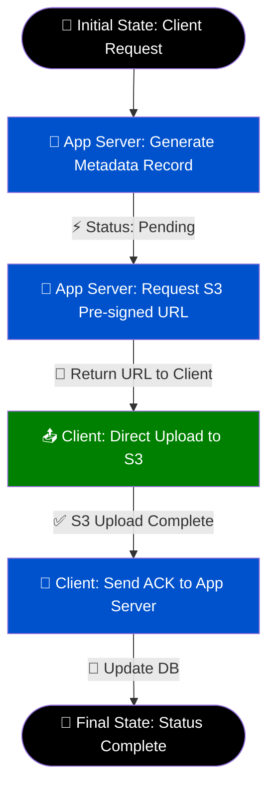

# System Design: Architecting a Scalable Pastebin with Text Search

## Glossary

The following table defines the essential technical terms and concepts utilized when designing a scalable text-sharing system (Pastebin) with search capabilities.

| Term | Definition |
| :--- | :--- |
| **Bandwidth Bound** | A system bottleneck where the network interface's maximum data transfer rate (e.g., 10 Gbps on an EC2 instance) limits the application's throughput before CPU or memory limits are reached. |
| **Change Data Capture (CDC)** | A software design pattern used to determine and track data that has changed so that action can be taken using the changed data, often used to replicate data to a search index. |
| **Inverted Index** | A database index storing a mapping from content (such as words or numbers) to its locations in a document or a set of documents. This is the core data structure used by search engines like Elasticsearch. |
| **Object Store** | A data storage architecture that manages data as objects (e.g., AWS S3), highly optimized for storing large, unstructured blobs of data like text files or media. |
| **P99 Latency** | The 99th percentile latency. It indicates that 99% of requests are faster than this value, and 1% are slower. It is a critical metric for understanding the worst-case user experience. |
| **Pre-signed URL** | A URL generated by an object storage service that grants temporary, limited access to upload or download a specific object directly, bypassing the application server. |
| **Scatter-Gather** | A querying pattern in distributed databases where a request is broadcast (scattered) to all partitions, and the responses are aggregated (gathered) before returning to the client. |

## Core Concepts

Designing a text-sharing service like Pastebin involves managing the storage, retrieval, and indexing of potentially massive amounts of unstructured text. While the basic premise is simple, scaling the application by 10,000x and introducing text search dramatically shifts the architectural requirements.

### System Requirements and Capacity Planning

Before designing the architecture, it is necessary to establish the baseline traffic and storage expectations. 
- **Traffic:** 1 million new pastes per day. This translates to roughly 10 writes per second.
- **Read/Write Ratio:** 5:1, meaning 50 reads per second.
- **Payload Size:** The average text size is 10 KB, with a maximum allowed size of 10 MB.

**Storage Calculations:**
At 1 million pastes per day averaging 10 KB each, the system ingests 10 GB of data daily. Over a year, this equates to 3.65 TB. If the system guarantees permanent storage for 10 years, the raw storage requirement is 36.5 TB. To ensure high availability and durability, data must be replicated (typically with a replication factor of 3), bringing the total required disk capacity to over 100 TB. 

### The Naive Approach: Bandwidth-Bound Architecture

In a standard, naive implementation, a client sends the text payload directly to the application server (Upload Service), which then forwards it to a database or object store. Similarly, for reads, the Download Service fetches the text from the database and serves it back to the client.

While this works at 10 writes per second, it fails spectacularly at scale. If traffic scales by 10,000x, the system would process 100,000 writes and 500,000 reads per second. At 10 KB per read, 500,000 reads per second requires 5 GB/s (40 Gbps) of outbound bandwidth. A standard AWS EC2 instance typically supports around 10 Gbps of continuous bandwidth. Therefore, routing text payloads through the application servers makes the system **bandwidth bound**, requiring an excessive number of application servers simply to handle network traffic, rather than compute load.

### The Optimal Approach: Pre-signed URLs and Object Storage

To resolve the bandwidth bottleneck, the architecture must decouple the metadata (e.g., paste ID, user ID, creation date) from the actual text payload. 

1. **Metadata Store:** A relational database (like PostgreSQL) or a NoSQL database (like DynamoDB) stores the metadata.
2. **Object Store:** AWS S3 (or equivalent) stores the raw text files.

Instead of the application server acting as a proxy for the text data, it acts as a coordinator. When a client wants to upload a file, the application server generates an S3 **Pre-signed URL**. The client uses this URL to upload the 10 MB text blob directly to S3. The application server only handles a few bytes of metadata, completely eliminating the bandwidth bottleneck on the compute instances. 

### Integrating Text Search

Adding text search to a Pastebin clone introduces significant complexity. While object stores (S3) are cheap and infinitely scalable, they cannot be queried by content. 

To enable search, the text must be indexed in a search engine like **Elasticsearch**, which uses an inverted index. Interestingly, Elasticsearch supports massive individual records (up to 200 MB), and PostgreSQL supports blob columns up to 1-4 GB. However, writing directly to Elasticsearch from the client is insecure, and routing the 10 MB text through the application server to Elasticsearch reintroduces the bandwidth bottleneck.

The optimal pattern is an asynchronous DB trigger or Change Data Capture (CDC) pipeline:
1. The text is uploaded to S3.
2. The metadata is marked as "complete" in PostgreSQL.
3. A DB trigger or CDC tool (like Debezium) detects this status change and drops an event in a message queue.
4. A background Task Runner consumes the event, fetches the text from S3 (within the high-bandwidth internal data center network), and indexes it into Elasticsearch.

### Latency Estimates (P99)

When designing for global users, P99 latency estimates must account for poor network conditions (e.g., a dial-up connection in a rural area). 

- **Client Network Round Trip:** ~5 seconds for a slow rural connection.
- **Intra-Data Center Network:** ~0.5 milliseconds per hop (negligible).
- **Disk Seek Time:** ~10 milliseconds.
- **Disk Write Time:** ~30 milliseconds per megabyte.

For a maximum 10 MB upload, the disk write time is 300 ms. The complete upload flow (requesting the URL, uploading to S3, and sending an acknowledgment) requires three round trips to the client. Therefore, the P99 latency for a maximum-size payload on a poor connection can easily reach 15 seconds (3 round trips * 5s + 300ms disk time). 

## Examples

### Example 1: The Upload Workflow with Pre-signed URLs

To ensure the application servers are not overwhelmed by large text payloads, the upload process is broken into a multi-step orchestration using Pre-signed URLs. 

Below is a visual step-by-step walkthrough of the optimal upload algorithm.



**Code Example: Metadata Record Generation**
When the client initiates the upload, the application server creates a record in PostgreSQL with a `pending` status.

```sql
-- Insert initial pending record
INSERT INTO paste_metadata (paste_id, user_id, s3_bucket_key, status, created_at)
VALUES ('xgh82x', 'user_991', 's3://pastebin-data/xgh82x.txt', 'PENDING', NOW());
```

Once the client successfully uploads the 10 MB blob directly to S3 using the Pre-signed URL, it sends an acknowledgment (ACK) to the application server. The server then updates the status to `COMPLETE`, making the paste visible to other users.

```sql
-- Update record upon client ACK
UPDATE paste_metadata 
SET status = 'COMPLETE' 
WHERE paste_id = 'xgh82x';
```

### Example 2: Asynchronous Text Search Indexing

If users need to search through the contents of public pastes, the system cannot rely on S3 alone. S3 is a key-value store and does not support full-text search. We must replicate the text data into Elasticsearch. 

Because we want to avoid the bandwidth bottleneck of routing the upload through the application server, we utilize a Task Runner within the data center. The data center has massive internal bandwidth, making it safe to pull from S3 and push to Elasticsearch asynchronously.


By keeping this process asynchronous, the user's upload time is not penalized by the time it takes to index the document in Elasticsearch. The user experiences a fast upload via S3, and the search index becomes eventually consistent a few milliseconds (or seconds) later.

### Architecture Comparison Table

| Feature | Naive Architecture | Optimal Architecture |
| :--- | :--- | :--- |
| **Data Flow** | Client ➔ App Server ➔ Database | Client ➔ S3 (Direct via Pre-signed URL) |
| **App Server Load** | High (Processes 100% of payload bytes) | Low (Processes only metadata bytes) |
| **Bandwidth Bottleneck** | Highly susceptible at 10,000x scale | Eliminated at the application layer |
| **Search Indexing** | Synchronous write through App Server | Asynchronous via CDC and Task Runners |
| **Storage Engine** | Monolithic RDBMS | S3 (Blobs) + Postgres (Meta) + Elastic (Search) |

## Summary

Architecting a scalable text-sharing platform requires a strict separation of concerns between metadata management and raw payload storage. While a naive architecture routing all traffic through application servers functions adequately at a small scale (1 million requests per day), it rapidly becomes bandwidth-bound when scaled up. 

By leveraging **S3 Pre-signed URLs**, the system successfully offloads heavy bandwidth requirements directly to the object storage layer, allowing the application servers to remain lightweight and highly concurrent. Furthermore, introducing text search requires careful asynchronous design. Utilizing **Change Data Capture (CDC)** and internal data-center Task Runners allows the system to build an inverted index in Elasticsearch without reintroducing network bottlenecks or penalizing the end-user's P99 upload latency. Ultimately, this decoupled approach ensures high availability, cost-efficiency, and resilience under massive traffic spikes.